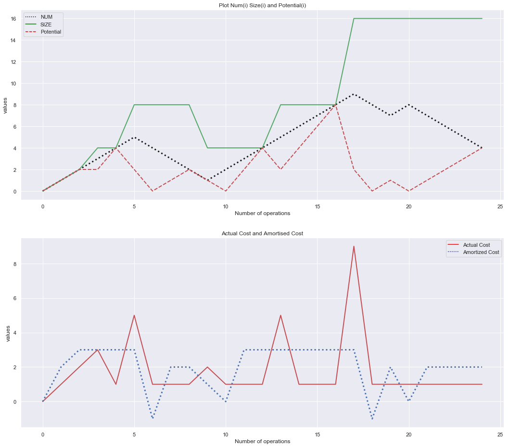

### `Dynamic Table Visualization`
### `Amortized & Actual cost Analysis`
>Amortized Analysis is used for algorithms where an occasional operation is very slow, but most of the other operations are faster. In Amortized Analysis, we analyze a sequence of operations and guarantee a worst case average time which is lower than the worst case time of a particular expensive operation.
The example data structures whose operations are analyzed using Amortized Analysis are Hash Tables, Disjoint Sets and Splay Trees.

